# 📱 ACE Mobile - App Flow & Visual Gallery

This document provides a detailed walkthrough of the ACE Mobile user experience, showcasing the logic and design of each screen.

---

## 🚀 1. App Entry & Onboarding

### 🟢 Splash Screen
- **Logic**: Pre-loads user preferences from `SharedPreferences` while displaying a premium animation sequence.
- **Visuals**: Features a spring-scale logo animation and a segmented loading bar.
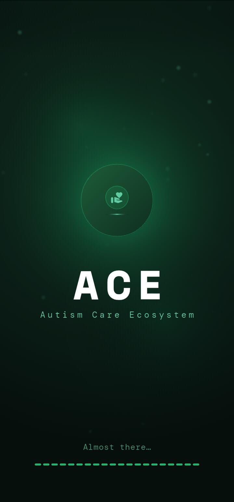

### 🔵 Authentication
- **Logic**: Secure gateway using Firebase Auth. Supports Email/Password and Google Sign-In via `AuthWrapper`.
- **Visuals**: Professional login screen with high-quality background imagery.
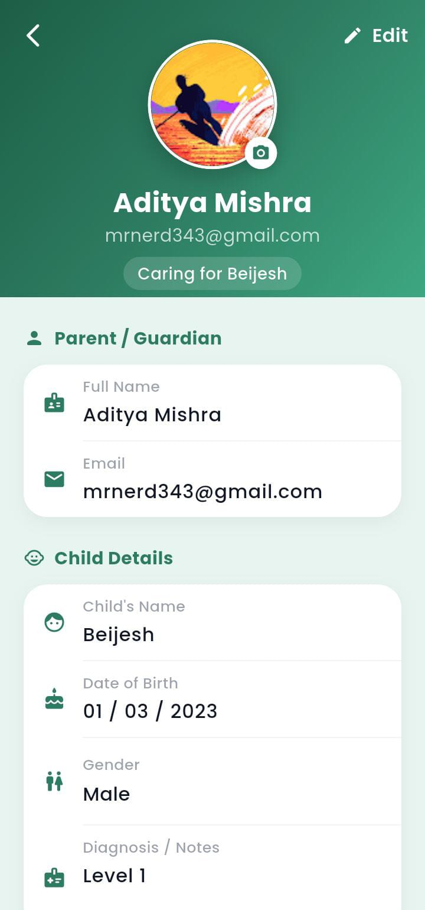

### 🟡 Onboarding Walkthrough
- **Logic**: A 5-page introduction for new users. Sets a persistent flag (`onboarding_done`) upon completion.
- **Visuals**: Glassmorphism cards and descriptive icons.
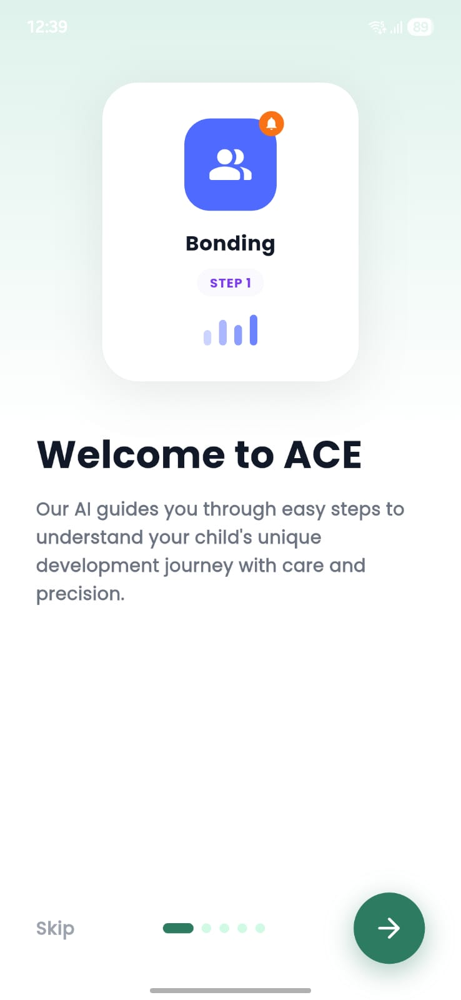

---

## 🏠 2. The Main Dashboard

### 👨‍👩‍👧 Parent Home Screen
- **Logic**: Dynamic state-driven greeting and daily goal tracker. Fetches child profile data from `ProfileProvider`.
- **Visuals**: Clean card-based layout with quick action buttons for assessments.
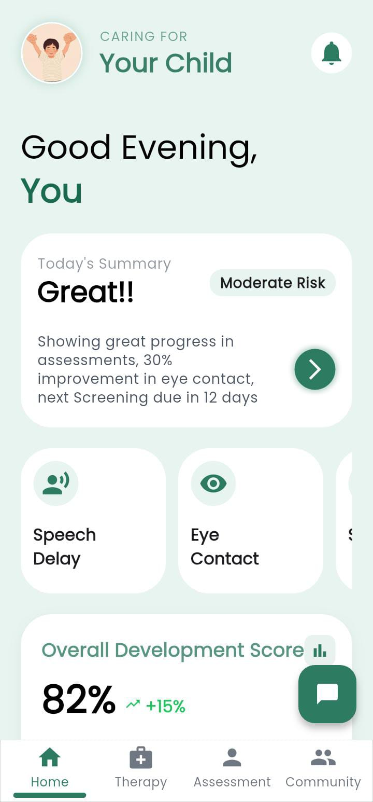

### 👨‍⚕️ Doctor Dashboard
- **Logic**: View-only mode for medical professionals to monitor patient progress and review screening results.
- **Visuals**: Summary list of registered patients with status indicators.
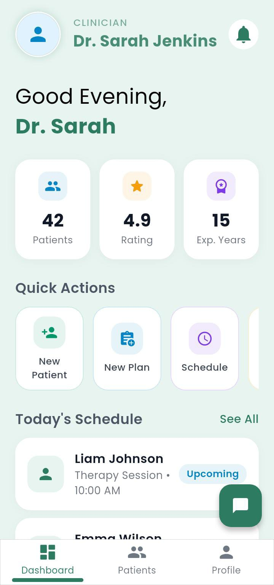

---

## 🧠 3. AI Screening & Assessment Games

### 🦋 Eye Contact (Butterfly Exercise)
- **Logic**: Real-time gaze vector tracking using Google ML Kit. Rewards the child when they maintain eye contact with the moving butterfly.
- **Visuals**: Animated butterfly stimuli overlaying a camera feed.
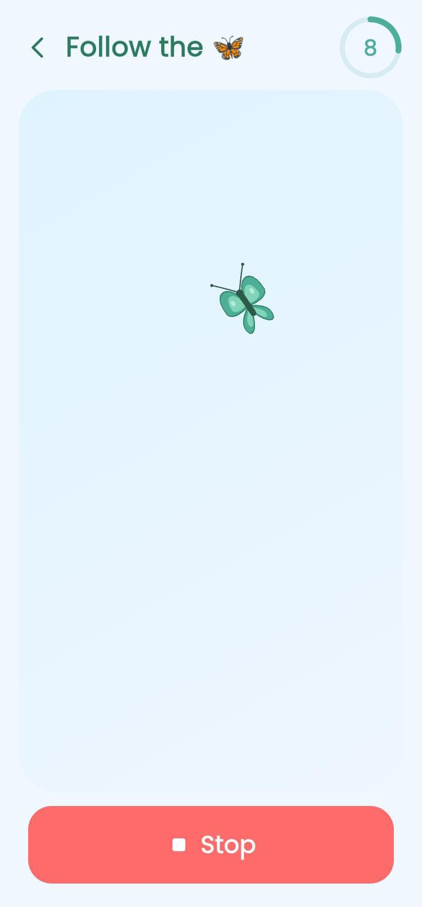

### 🤸 Physical Imitation (Pose Match)
- **Logic**: On-device single-pose estimation using TensorFlow Lite (MoveNet). Calculates cosine similarity between the user's pose and a target pose.
- **Visuals**: Live camera feed with skeleton overlay (17 key joints).
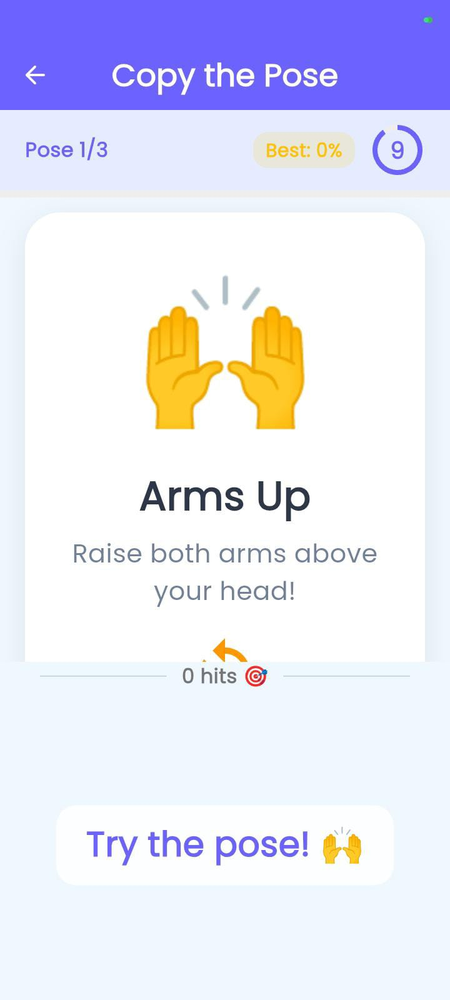

### 😊 Emotion Assessment
- **Logic**: Facial landmark detection (46 points) to analyze smile and eye-open probabilities during evoked stimuli.
- **Visuals**: Emotional stimuli reaction capture.
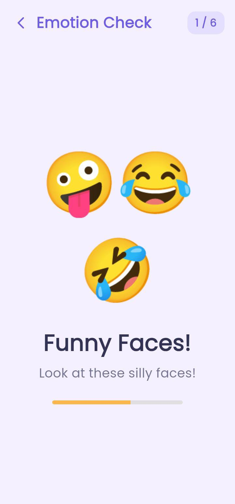

---

## 🧘‍♀️ 4. Therapy & Grounding Tools

### 🫁 Breathing Pacer
- **Logic**: Animated 4-2-6 breathing cycle (Inhale, Hold, Exhale) designed to lower anxiety.
- **Visuals**: Rhythmic pulsing circle with phase-aware textual cues.
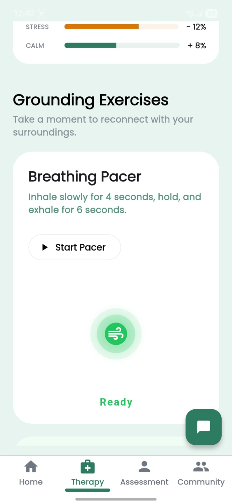

### 🖐 5-4-3-2-1 Grounding
- **Logic**: Interactive sensory checklist to bring a user back to the present moment during high stress.
- **Visuals**: Icon-rich step-by-step guidance.
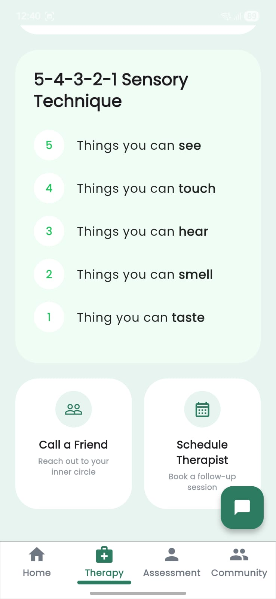

---

## 👤 5. Profile & Settings

### ⚙️ User Settings
- **Logic**: Allows editing of child information and medical preferences. Integrated with local and cloud storage.
- **Visuals**: Clean form layouts and profile image selection.
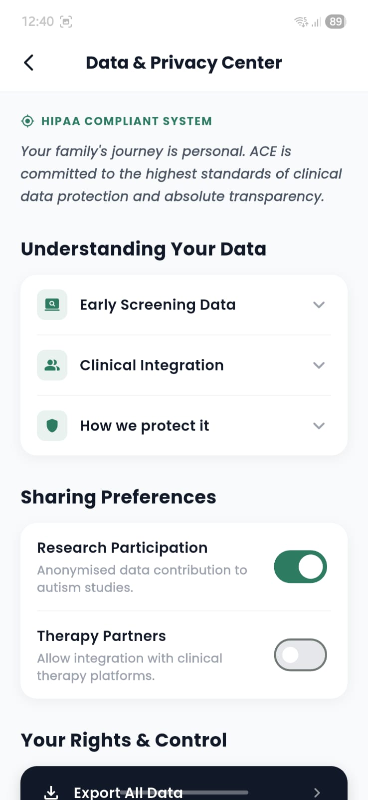

---

<i>To add your own screenshots, simply place the images in the `docs/screenshots/` folder with the names listed above.</i>

