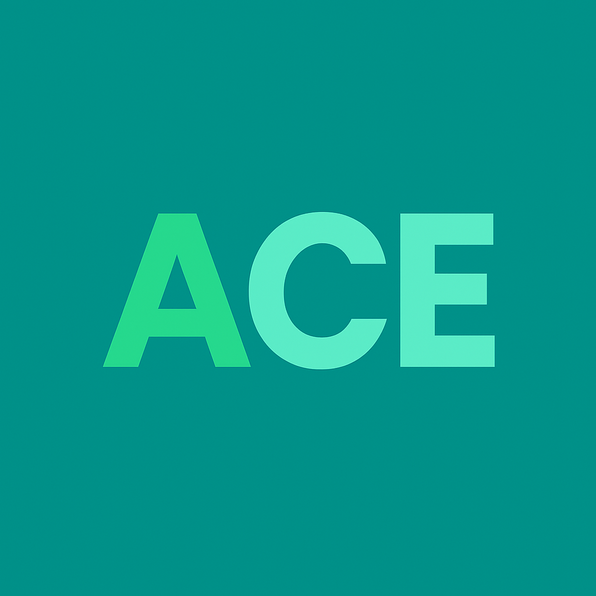

<div align="center">
  
  <h1>ACE (Autism Care Ecosystem) Mobile</h1>
  <p><strong>An advanced, AI-driven mobile application for Autism spectrum disorder management, screening, and therapy.</strong></p>
  <p><i>Developed by Akarsh Solanky</i></p>
</div>

<hr />

## 📖 Overview

ACE Mobile is a comprehensive, intelligently designed Flutter application built to support the entire autism care triad: **Children**, **Parents/Caregivers**, and **Medical Professionals**. 

By blending gamified therapy exercises, on-device machine learning for behavioral assessment, and large language models (LLMs) for personalized guidance, ACE bridges the gap between clinical visits and at-home developmental support.

---

## ✨ Core Features & Capabilities

The ACE ecosystem is divided into distinct, role-based experiences powered by advanced technologies.

### 🧠 1. AI-Driven Screening & Diagnostics
*   **M-CHAT AI Provider**: We've digitized the standard Modified Checklist for Autism in Toddlers (M-CHAT). Instead of static forms, parents interact with an AI interviewer that dynamically asks the 20 M-CHAT questions, scoring responses in real-time to generate an early-risk assessment report.
*   **Emotion Assessment (Google ML Kit)**: A behavioral screening tool where children watch emotionally evocative visual stimuli. Using the device's camera and `google_mlkit_face_detection`, the app measures facial landmarks (smiling, eye openness) to detect atypical empathy responses or reduced emotional congruence.
*   **Eye Contact Gamification**: The "Butterfly Exercise" encourages children to maintain eye contact with the screen. ML Kit tracks gaze vectors and face angles, rewarding sustained attention with visual feedback.
*   **Physical Imitation (TensorFlow Lite - MoveNet)**: A motor-skills diagnostic tool. The app uses `movenet.tflite` (a lightweight pose estimation model) to track 17 key body joints. Children mimic on-screen poses (e.g., raising arms, clapping), and the app calculates the cosine similarity between the child's pose and the target pose, assessing gross motor planning capabilities.

### 💬 2. Context-Aware AI Chat Assistant
*   **Role-Based Personas**: An LLM-powered assistant (housed in `features/AI_Chat_Assistant`) that knows exactly who it's talking to.
    *   *For Parents*: Acts as a supportive, empathetic pediatric advisor, using the child's name, age, and recent diagnosis data.
    *   *For Doctors*: Acts as a clinical data retrieval assistant, providing quick summaries of patient metrics and literature.

### 🧘‍♀️ 3. Live State Monitoring & Therapy
*   **Meltdown Prediction Engine**: The `TherapyScreen` features a "Live Monitor" dashboard designed to ingest physiological data (simulated/wearable integration like heart rate and skin conductance) and establish daily patterns. It predicts incoming emotional dysregulation before a full meltdown occurs.
*   **Grounding Techniques**: 
    *   **Breathing Pacer**: A fully animated 4-2-6 breathing cycle guide (4s inhale, 2s hold, 6s exhale) with expanding/contracting visual cues and phase-aware colors.
    *   **5-4-3-2-1 Sensory Method**: Built-in interactive grounding cards to bring a child back to the present moment during high anxiety.

### 👨‍⚕️ 4. Doctor Dashboard & Patient Management
*   **Patient Roster**: Doctors have a dedicated dashboard (`doctor_dashboard_screen.dart`) summarizing their assigned patients, flagged by risk levels or recent assessment completions.
*   **Prescriptive Therapy Plans**: In `/doctor_therapy_plan`, doctors can view detailed clinical reports and adjust the child's "Therapy Level" (e.g., beginner, intermediate), tweak engagement metrics, and set daily action checklists that immediately reflect on the parent's home screen.

---

## 🗺️ User Flows & Navigation

ACE Mobile uses a robust routing architecture initialized in `main.dart`, handling three distinct user journeys:

### Onboarding Flow
1.  **Splash Screen (`/splash`)**: A visually rich, animated entry point featuring drifting glow orbs, a particle field, and a segmented loading bar. Behind the scenes, it pre-loads `ProfileProvider` data from SharedPreferences.
2.  **Authentication (`/login`)**: Email/Password and Google Sign-In powered by Firebase Auth.
3.  **Role Selection (`/role_selection`)**: First-time users declare their role (Parent/Caregiver vs. Doctor/Therapist).

### Parent / Caregiver Flow
1.  **Home Dashboard**: The central hub. Displays a "Good Morning, [Name]" header, today's specific goals, and quick-launch buttons for the child's daily exercises.
2.  **Therapy Tab**: Access to the meltdown predictor, heart rate monitor widget, and grounding exercises.
3.  **Assessments**: Launch the M-CHAT AI, Eye Contact game, or Imitation game. Results are pushed to Firestore for the doctor to review.
4.  **Community**: A forum view for parents to connect, share victories, and seek peer support.

### Doctor / Professional Flow
1.  **Doctor Dashboard**: A macroscopic view of all connected families.
2.  **Patient Details Profile**: Clicking a patient reveals their specific diagnosis, recent M-CHAT scores, and historical pose/emotion assessment accuracy.
3.  **Therapy Adjustments**: A specialized screen where the clinician can assign new routines (e.g., "Increase Eye Contact duration to 30 seconds").

---

## 🏗️ Architecture & Directory Structure

The application heavily utilizes the **Provider** pattern for reactive state management, adhering to a Feature-First folder structure.

```text
ace_mobile/
├── android/ & ios/         # Native platform configurations (Permissions, Info.plist)
├── assets/
│   ├── images/             # appLogo.png, UI assets
│   └── models/             # movenet.tflite (On-device pose estimation model)
│
└── lib/
    ├── core/               # App-wide constants
    │   └── constants.dart  # Colors (appColors), typography, theme definitions
    │
    ├── shared/             # Reusable UI components (buttons, custom app bars)
    │
    ├── features/           # Distinct domain modules
    │   ├── splash/         # Animated entry screen (`splash_screen.dart`)
    │   ├── auth/           # Login UI, Role Selection, wrappers
    │   ├── profile/        # `ProfileProvider`: User data, role, current child data
    │   ├── onboarding/     # App tutorial screens
    │   │
    │   ├── assessment/     # M-CHAT logic and `AssessmentProvider`
    │   ├── emotion_assessment/ # Emotion detection using `google_mlkit_face_detection`
    │   ├── eye_contact/    # Camera overlay and gaze tracking (`EyeContactProvider`)
    │   ├── imitation/      # TFlite vision logic (`ImitationProvider`, Camera setup)
    │   │
    │   ├── Therapy/        # Live dashboard, `_BreathingPacerCard`, state predictors
    │   ├── AI_Chat_Assistant/# Chat UI (`chat_bubble.dart`), LLM API integration
    │   ├── community/      # Social feeds and list views
    │   │
    │   └── doctor/         # Clinician-only views
    │       ├── doctor_dashboard_screen.dart
    │       ├── patient_detail_screen.dart
    │       └── doctor_therapy_plan_screen.dart 
    │
    └── main.dart           # Entry point: Firebase init, Provider injection, Theme setup
```

---

## ⚙️ Technical Specs & Toolkit

*   **Framework:** Flutter (Dart, SDK ^3.11.0)
*   **State Management:** `provider: ^6.1.2`
*   **Backend Services:** Firebase Core & Auth (`firebase_core`, `firebase_auth`), Google Sign-In
*   **Machine Learning (Edge computing):**
    *   `google_mlkit_face_detection: ^0.13.2` — 46 facial landmark tracking, eye open probabilities, smile probabilities.
    *   `tflite_flutter: ^0.11.0` — Running the MoveNet single-pose lightning model natively via Android NNAPI / iOS CoreML delegates for 30+ fps pose tracking.
    *   `camera: ^0.11.4` — High-speed frame extraction for ML processing.
*   **UI/UX:**
    *   `google_fonts: ^8.0.2` (Poppins, Space Grotesk, DM Mono)
    *   `flutter_animate: ^4.5.2` (Micro-interactions)
    *   `persistent_bottom_nav_bar: ^6.2.1`

---

## 🛠️ Performance & Size Optimizations
The app is heavily optimized for distribution and edge-ML performance:
*   **Minification**: R8 code shrinking and resource shrinking (`isMinifyEnabled`) are configured in Android/app/build.gradle.kts.
*   **Targeted Dependencies**: The bulky `google_ml_kit` umbrella package has been stripped in favor of the specialized `google_mlkit_face_detection` to keep native library (.so) payload minimal.
*   **ABI Splits**: Separate binaries are built for `arm64-v8a` and `armeabi-v7a` drastically reducing the final APK/AppBundle size.
*   **Custom ProGuard**: Keep rules injected for ML Kit, TFLite GPU delegates, and Firebase to ensure runtime stability post-minification.

---

## 📥 Setup & Installation

1.  **Clone the repository.**
2.  **Dependencies:**
    ```bash
    flutter clean
    flutter pub get
    ```
3.  **Environment Variables (`.env`)**:
    Create a `.env` file at the root level and include necessary API keys (LLM endpoints, backend URLs). Make sure this is added to `.gitignore`.
4.  **Firebase Config**:
    Ensure your `google-services.json` is located in `android/app/` and `GoogleService-Info.plist` is in `ios/Runner/`.
5.  **Build**:
    ```bash
    # For a debug build to a physical device:
    flutter run

    # For a minimized, optimized release build:
    flutter build apk --release --split-per-abi
    ```

---
<p align="center"><i>Empowering families, connecting professionals, and supporting neurodiversity through technology.</i></p>
