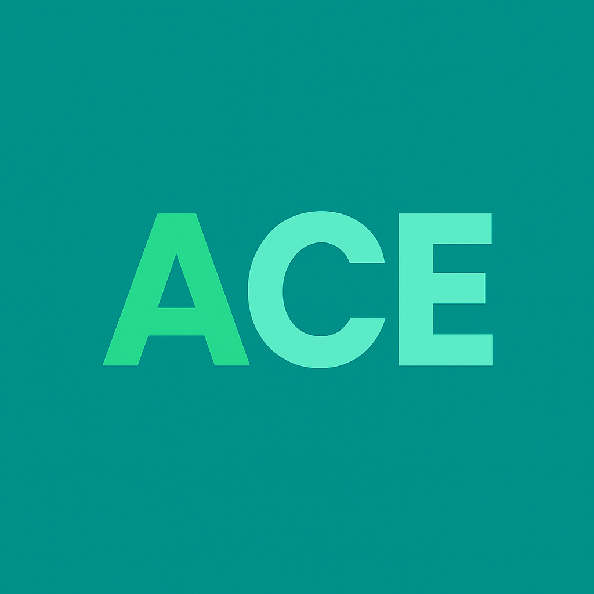

<div align="center">
  
  <h1>ACE (Autism Care Ecosystem) Mobile</h1>
  <p><strong>An advanced, AI-driven mobile application for Autism spectrum disorder management, screening, and therapy.</strong></p>
  <p><i>Developed by <a href="https://github.com/mro-nerd">Aditya Mishra</a>, <a href="https://github.com/KhushneetSingh">Khushneet Singh</a>, and <a href="https://github.com/ItsAkarsh05">Akarsh Solanky</a></i></p>

  <p>
    
    
    
    
    
  </p>
</div>

<hr />

## 📖 Overview

ACE Mobile is a comprehensive, intelligently designed Flutter application built to support the entire autism care triad: **Children**, **Parents/Caregivers**, and **Medical Professionals**. 

By blending gamified therapy exercises, on-device machine learning for behavioral assessment, and large language models (LLMs) for personalized guidance, ACE bridges the gap between clinical visits and at-home developmental support.

> 📸 **See the full visual walkthrough:** [APP_FLOW.md](APP_FLOW.md) — screenshots of every screen in the app.
>
> 🏗️ **System Architecture Diagram:** [docs/system_architecture.html](docs/system_architecture.html) — open in a browser for a high-resolution, presentation-ready architecture overview.

---

## 🎥 Video Explanation
<div align="center">
  <video src="https://github.com/user-attachments/assets/a21460e8-707f-4bd9-8c63-30051019eb49" width="300" controls></video>
</div>

---

## ✨ Core Features & Capabilities

The ACE ecosystem is divided into distinct, role-based experiences powered by advanced technologies.

### 🧠 1. AI-Driven Screening & Diagnostics
*   **M-CHAT AI Interviewer**: We've digitized the standard Modified Checklist for Autism in Toddlers (M-CHAT). Instead of static forms, parents interact with an AI interviewer that dynamically asks the 20 M-CHAT questions, scoring responses in real-time to generate an early-risk assessment report.
*   **Emotion Assessment (Google ML Kit)**: A behavioral screening tool where children watch emotionally evocative visual stimuli. Using the device's camera and `google_mlkit_face_detection`, the app measures 46 facial landmarks (smiling probability, eye openness) to detect atypical empathy responses or reduced emotional congruence.
*   **Eye Contact Gamification**: The "Butterfly Exercise" encourages children to maintain eye contact with the screen. ML Kit tracks gaze vectors and face angles, rewarding sustained attention with visual feedback.
*   **Physical Imitation (TensorFlow Lite - MoveNet)**: A motor-skills diagnostic tool. The app uses `movenet.tflite` (a lightweight pose estimation model) to track 17 key body joints at 30+ FPS. Children mimic on-screen poses (e.g., raising arms, clapping), and the app calculates the cosine similarity between the child's pose and the target pose, assessing gross motor planning capabilities.

### 💬 2. Context-Aware AI Chat Assistant
*   **Role-Based Personas**: An LLM-powered assistant (housed in `features/AI_Chat_Assistant`) that knows exactly who it's talking to.
    *   *For Parents*: Acts as a supportive, empathetic pediatric advisor, using the child's name, age, and recent diagnosis data.
    *   *For Doctors*: Acts as a clinical data retrieval assistant, providing quick summaries of patient metrics and literature.

### 🧘‍♀️ 3. Therapy & Grounding Tools
*   **Breathing Pacer**: A fully animated 4-2-6 breathing cycle guide (4s inhale, 2s hold, 6s exhale) with expanding/contracting visual cues and phase-aware colors.
*   **5-4-3-2-1 Sensory Grounding**: Built-in interactive grounding cards to bring a child back to the present moment during high anxiety.
*   **Meltdown Prediction Engine**: The `TherapyScreen` features a "Live Monitor" dashboard designed to ingest physiological data (simulated/wearable integration like heart rate and skin conductance) and establish daily patterns. It predicts incoming emotional dysregulation before a full meltdown occurs.

### 👨‍⚕️ 4. Doctor Dashboard & Patient Management
*   **Patient Roster**: Doctors have a dedicated dashboard summarizing their assigned patients, sorted by risk level (high → medium → low → pending).
*   **Summary Statistics**: Live-computed cards showing total patients, high-risk flags this week, sessions completed today, and average assessment scores.
*   **Interactive Progress Graphs**: Patient detail screens feature `fl_chart` LineCharts with color-coded trend lines per session type, date-based axes, inline legends, and touch-interactive tooltips.
*   **Formatted Session Metrics**: A type-aware `SessionMetricsCard` widget renders human-readable metrics for each session type (M-CHAT flags, pose match %, gaze scores, dominant emotions) instead of raw JSON.
*   **Prescriptive Therapy Plans**: Doctors can assign therapeutic tasks (e.g., "Complete Eye Contact for 30s") with titles, descriptions, and due dates. Actions sync to the parent's home screen in real-time via Supabase Realtime channels.
*   **Clinical Notes**: A doctor-to-parent messaging system allowing broadcast or targeted clinical notes.
*   **Join Code Linking**: Parents share a unique `join_code` with their doctor to securely establish a clinical relationship.

### 📈 5. Progress Tracking & Community
*   **Progress Dashboard**: Parents can view a historical log of all completed assessments and therapy sessions with milestone tracking.
*   **Secure Cloud Sync**: Game scores, behavioral metrics, and LLM-generated summaries are synchronized in real-time to Supabase (`sessions` table) with strict matching via unique parent-child constraints.
*   **Community Forum**: A social space where parents and caregivers share experiences, victories, and peer support.
*   **Relational Architecture**: View our [Database Schema](docs/DATABASE_SCHEMA.md) for details on how `profiles`, `children`, `sessions`, `therapy_plans`, `therapy_actions`, and `clinical_notes` interact.

---

## 🗺️ User Flows & Navigation

ACE Mobile uses a robust routing architecture initialized in `main.dart`, handling three distinct user journeys:

### Onboarding Flow
1.  **Splash Screen (`/splash`)**: A visually rich, animated entry point featuring drifting glow orbs, a particle field, and a segmented loading bar. Behind the scenes, it pre-loads `ProfileProvider` data from SharedPreferences.
2.  **Authentication (`/login`)**: Email/Password and Google Sign-In powered by Supabase Auth (`AuthService`). Includes robust error handling with user-friendly messages for all Supabase exceptions.
3.  **Role Selection (`/role_selection`)**: First-time users declare their role (Parent/Caregiver vs. Doctor/Therapist). Gracefully handles and displays errors during profile initialization.

### Parent / Caregiver Flow
1.  **Home Dashboard**: The central hub. Displays a "Good Morning, [Name]" header, today's therapy action goals (synced from doctor in real-time), and quick-launch buttons for the child's daily exercises.
2.  **Therapy Tab**: Access to the breathing pacer, grounding exercises, and the ACE AI Chat assistant.
3.  **Assessments**: Launch the M-CHAT AI, Eye Contact game, Pose Imitation, or Emotion Assessment. Results are pushed to Supabase for the doctor to review.
4.  **Progress**: Historical view of all completed sessions and milestones.
5.  **Community**: A forum view for parents to connect, share victories, and seek peer support.

### Doctor / Professional Flow
1.  **Doctor Dashboard**: A macroscopic view of all connected families with summary statistics (total patients, risk flags, daily sessions, average scores).
2.  **Patient Roster**: Searchable list of assigned patients, sorted by risk level with recent activity indicators.
3.  **Patient Details**: Clicking a patient reveals session history, interactive progress graphs (fl_chart), formatted session metrics, and risk flags.
4.  **Therapy Plan Management**: Assign daily action checklists, adjust therapy levels, and toggle action completion — all reflected on the parent's home screen within 3 seconds via Supabase Realtime.
5.  **Clinical Notes**: Send broadcast or targeted messages to parents.
6.  **Doctor Profile**: View and manage account information and settings.

---

## 🏗️ Architecture & Directory Structure

The application utilizes the **Provider** pattern for reactive state management, adhering to a Feature-First folder structure with a dedicated service abstraction layer.

```text
ace_mobile/
├── android/ & ios/         # Native platform configurations (Permissions, Info.plist)
├── assets/
│   ├── images/             # appLogo.png, UI assets
│   └── models/             # movenet.tflite (On-device pose estimation model)
│
└── lib/
    ├── core/               # App-wide constants
    │   └── constants.dart  # Colors (appColors), typography, theme definitions
    │
    ├── backend/            # Centralized cloud services
    │   ├── supabase_client.dart  # .env based Supabase initialization
    │   ├── supabase_service.dart # Legacy business logic (Profiles, Children, Sessions)
    │   ├── backend.dart          # Barrel exports
    │   └── services/             # Dedicated service layer
    │       ├── auth_service.dart           # Supabase Auth (Email/Password, Google, session management)
    │       ├── profile_service.dart        # User profile CRUD
    │       ├── child_service.dart          # Child records & join code management
    │       ├── session_service.dart        # Assessment session persistence & retrieval
    │       ├── therapy_service.dart        # Therapy plans & action items (Realtime sync)
    │       └── clinical_notes_service.dart # Doctor-to-parent clinical messaging
    │
    ├── shared/             # Reusable UI components (buttons, custom app bars)
    │
    ├── features/           # Distinct domain modules
    │   ├── splash/         # Animated entry screen
    │   ├── auth/           # Login UI, AuthWrapper, Role Selection
    │   ├── profile/        # ProfileProvider: User data, role, current child data
    │   ├── onboarding/     # Multi-page app tutorial walkthrough
    │   │
    │   ├── dashboard/      # Parent navigation shell
    │   ├── HomeScreen.dart  # Parent home dashboard (goals, quick actions)
    │   │
    │   ├── assessment/     # M-CHAT AI logic and AssessmentProvider
    │   ├── emotion_assessment/ # Emotion detection (google_mlkit_face_detection)
    │   ├── eye_contact/    # Camera overlay and gaze tracking (EyeContactProvider)
    │   ├── imitation/      # TFLite MoveNet vision logic (ImitationProvider)
    │   │
    │   ├── Therapy/        # Breathing pacer, grounding, live monitor
    │   ├── AI_Chat_Assistant/ # Chat UI (chat_bubble.dart), OpenRouter LLM integration
    │   ├── progress/       # Progress tracking dashboard
    │   ├── community/      # Social feeds and list views
    │   │
    │   └── doctor/         # Clinician-only module
    │       ├── doctor_dashboard_provider.dart  # Live stats, patient fetching, Realtime subscriptions
    │       ├── clinical_notes_provider.dart    # Clinical notes state management
    │       ├── doctor_bottom_navbar.dart       # Doctor navigation shell
    │       └── screens/
    │           ├── doctor_dashboard_screen.dart    # Summary stats, recent patients
    │           ├── doctor_patients_screen.dart     # Full patient roster (risk-sorted)
    │           ├── patient_detail_screen.dart      # Session history, progress graphs, metrics
    │           ├── doctor_therapy_plan_screen.dart  # Prescriptive action plan management
    │           ├── doctor_progress_screen.dart     # Aggregate progress analytics
    │           └── doctor_profile_screen.dart      # Doctor profile & settings
    │
    └── main.dart           # Entry point: Supabase init, Provider injection, Theme setup
```

---

## ⚙️ Technical Specs & Toolkit

*   **Framework:** Flutter (Dart, SDK ^3.11.0)
*   **State Management:** `provider: ^6.1.2`
*   **Backend Services:** Supabase Auth & Database (`supabase_flutter`) with Realtime channels, Google Sign-In
*   **Machine Learning (Edge computing):**
    *   `google_mlkit_face_detection: ^0.13.2` — 46 facial landmark tracking, eye open probabilities, smile probabilities, gaze vector analysis.
    *   `tflite_flutter: ^0.11.0` — Running the MoveNet single-pose lightning model natively via Android NNAPI / iOS CoreML delegates for 30+ fps pose tracking.
    *   `camera: ^0.11.4` — High-speed frame extraction for ML processing.
*   **Charts:** `fl_chart` — Interactive line charts for progress visualization with per-session-type trend lines, tooltips, and legends.
*   **UI/UX:**
    *   `google_fonts: ^8.0.2` (Poppins, Space Grotesk, DM Mono)
    *   `flutter_animate: ^4.5.2` (Micro-interactions)
    *   `persistent_bottom_nav_bar: ^6.2.1`
*   **Database:** PostgreSQL via Supabase — 6 relational tables: `profiles`, `children`, `sessions`, `therapy_plans`, `therapy_actions`, `clinical_notes`. Full schema in [docs/DATABASE_SCHEMA.md](docs/DATABASE_SCHEMA.md).

---

## 🛠️ Performance & Size Optimizations
The app is heavily optimized for distribution and edge-ML performance:
*   **Minification**: R8 code shrinking and resource shrinking (`isMinifyEnabled`) are configured in Android/app/build.gradle.kts.
*   **Targeted Dependencies**: The bulky `google_ml_kit` umbrella package has been stripped in favor of the specialized `google_mlkit_face_detection` to keep native library (.so) payload minimal.
*   **ABI Splits**: Separate binaries are built for `arm64-v8a` and `armeabi-v7a` drastically reducing the final APK/AppBundle size.
*   **Custom ProGuard**: Keep rules injected for ML Kit and TFLite GPU delegates to ensure runtime stability post-minification.
*   **Resource Lifecycle Hardening**: Every provider implements explicit `dispose()` overrides to cancel timers, stream subscriptions, and prevent resource leaks.
*   **Zero Static Analysis Warnings**: Codebase passes `flutter analyze` with zero warnings — no unused imports, no unnecessary casts, all `print()` calls replaced with `debugPrint()`.

---

## 💻 Local Development Setup

To run ACE Mobile locally, you must provide your own API keys for Supabase and OpenRouter via a `.env` file. These keys are deliberately excluded from source control.

1. Create a file named `.env` inside `frontend_app/ace_mobile/`.
2. Add the following keys (replace with your actual credentials):

```env
GENAI_KEY=sk-or-v1-...
SUPABASE_URL=https://your-project.supabase.co
SUPABASE_ANON_KEY=eyJhbGciOi...
```

The application will throw an initialization error if these keys are missing.

---

## 📸 Screenshots

For a comprehensive visual walkthrough of every screen in the app, see **[APP_FLOW.md](APP_FLOW.md)**.

<div align="center">
  
  
  
  
  
  
  
  
</div>

---

## 🤝 Contributing

We welcome contributions to ACE Mobile! To contribute:

1.  **Fork** the repository.
2.  **Create a new branch** (`git checkout -b feature/your-feature`).
3.  **Commit your changes** (`git commit -m 'Add some feature'`).
4.  **Push to the branch** (`git push origin feature/your-feature`).
5.  **Open a Pull Request**.

Developed with ❤️ by **Aditya Mishra**, **Khushneet Singh**, and **Akarsh Solanky**.

---

## 📜 License

This project is licensed under the **Apache License 2.0**. See the [LICENSE](LICENSE) file for the full text.

---
<p align="center"><i>Empowering families, connecting professionals, and supporting neurodiversity through technology.</i></p>
