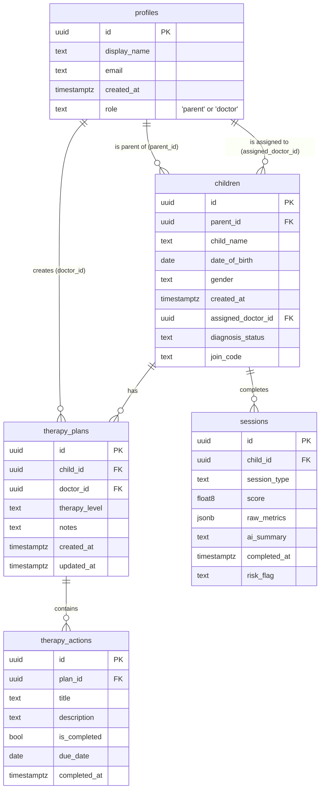

# 🗄️ Database Schema

The ACE Mobile application relies on a robust PostgreSQL database hosted on Supabase to manage user profiles, patient data, clinical assessments, therapy plans, and assigned therapeutic actions.

Below is the entity-relationship representation of our database.

## Schema Details

### `profiles`
The central hub for all users authenticated via Supabase Auth. Stores basic identity information.
- **`role`**: Differentiates between `parent`/`caregiver` and `doctor`/`medical professional`.

### `children`
Stores patient/child records.
- Associated with exactly one `parent_id` (the caregiver account).
- Can optionally be linked to a medical professional via `assigned_doctor_id`.
- Has an auto-generated `join_code` that parents can share with doctors to establish a clinical link.

### `sessions`
Logs all completed assessments (`mchat`, `imitation`, `eye_contact`, `emotion_assessment`).
- **`raw_metrics`**: A flexible `jsonb` column used to hold game-specific statistics without needing a rigid schema change per game.
- **`score`**: Normalized performance metric [0-100].
- **`ai_summary`**: Generated behavioral insight notes for this particular run.

### `therapy_plans`
A prescribed sequence of actions created by a doctor for a specific child.
- Defines the `therapy_level` and holds high-level clinician `notes`.

### `therapy_actions`
Individual tasks/exercises associated with a `therapy_plan`.
- Examples include "Complete Eye Contact Module for 30s" or "Daily Grounding Exercise".
- Tracked via `is_completed` and synced instantly to the parent's home screen.
